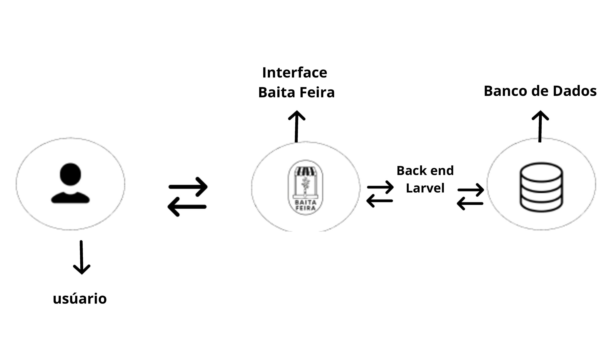
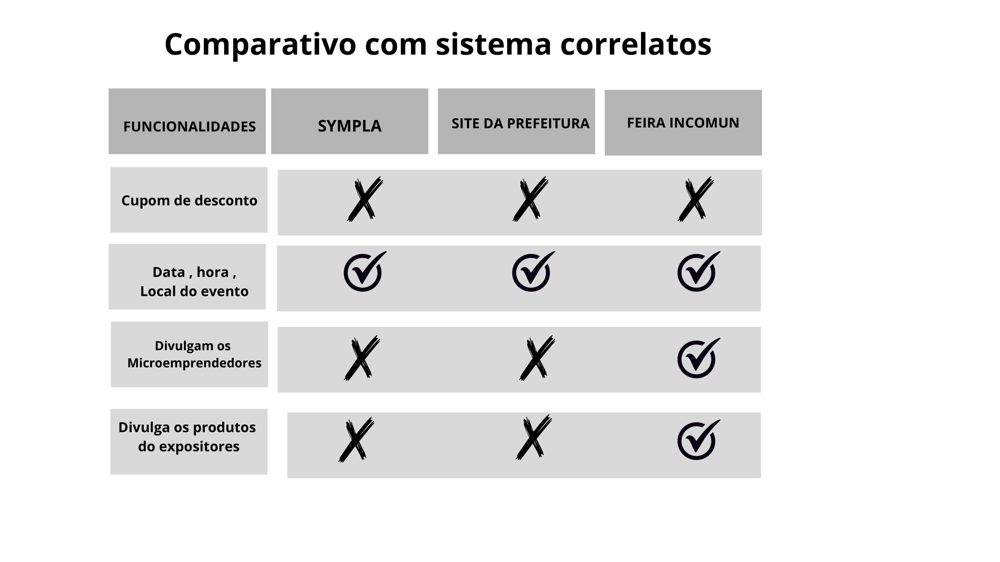
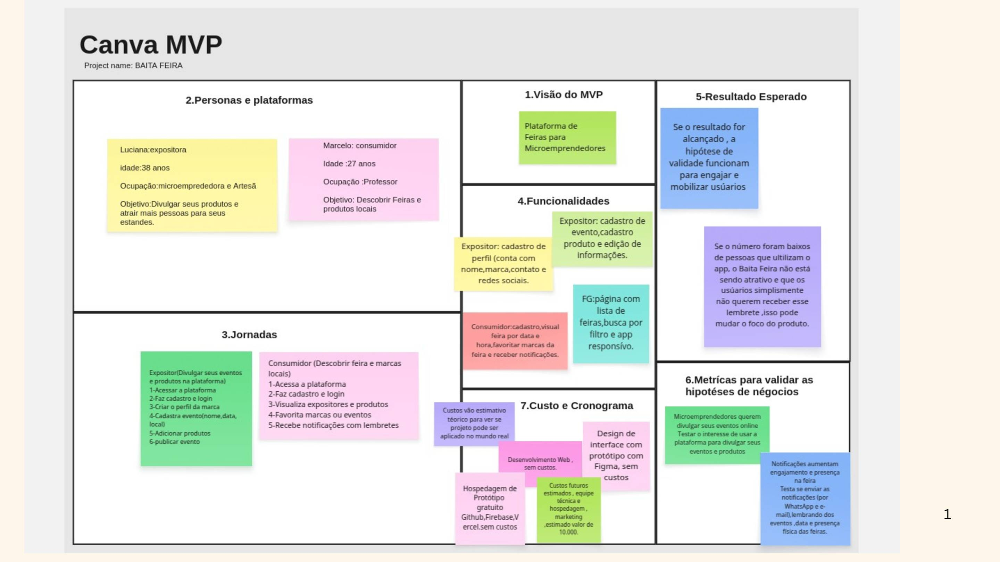
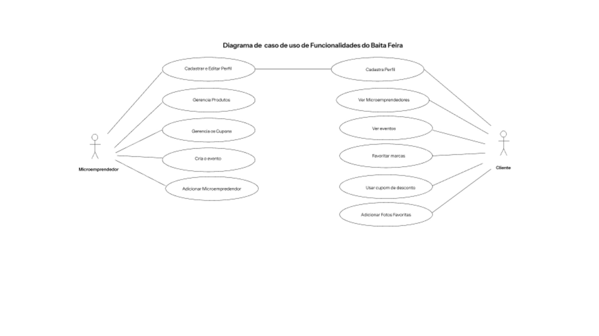
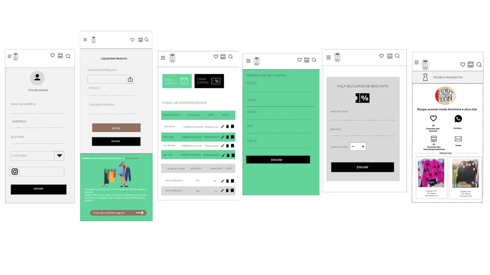
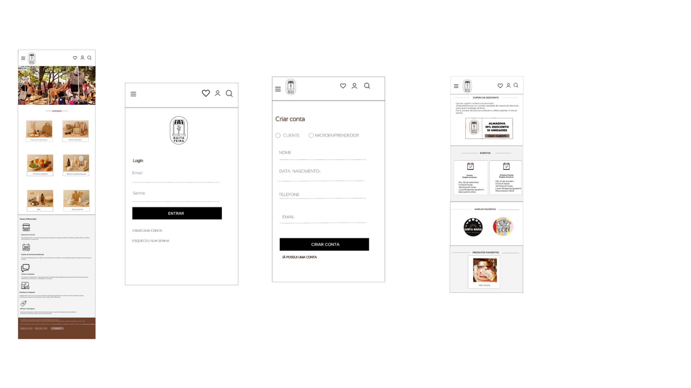
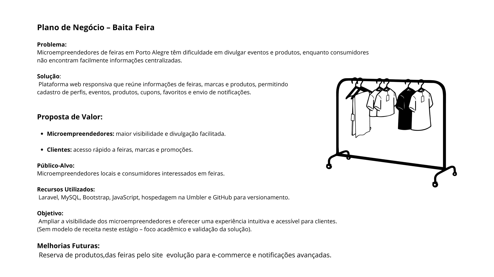

# Baita Feira:Conectando Microempreendedores e Clientes em Feiras de Porto Alegre

_Jordana Scher e Sofia Pedroso_

Este artigo tem como objetivo ilustrar a documentação de um projeto final na unidade curricular Projeto de Desenvolvimento II dos cursos Análise e Desenvolvimento de Sistemas, Sistemas para Internet e Ciência de Dados e Inteligência Analítica do Centro Universitário Senac-RS.

## Resumo do Projeto

Microempreendedores que participam de feiras em Porto Alegre enfrentam dificuldades para divulgar seus eventos e alcançar maior visibilidade junto ao público.
A ausência de um canal centralizado de informações gera baixa divulgação, reduz o engajamento dos consumidores e limita o crescimento dos pequenos negócios locais.
Este projeto propõe o desenvolvimento de uma aplicação web responsiva que conecte expositores e consumidores, reunindo em um só espaço dados sobre eventos, marcas e produtos.
Como resultado, espera-se ampliar a visibilidade dos microempreendedores, fortalecer a participação do público e estimular a valorização do comércio local.

## Definição do Problema

Microempresários que participam de feiras em Porto Alegre enfrentam dificuldades para divulgar seus eventos e
alcançar um público maior. Não existe um canal centralizado que concentre informações sobre os eventos, marcas
participantes, promoções e atualizações. Isso gera baixa visibilidade para os expositores e limita as oportunidades
de consumidores interessados em conhecer novidades e apoiar pequenos negócios locais.

## Objetivo Geral
Desenvolver uma aplicação web responsiva que centralize a divulgação de eventos de feiras em Porto Alegre, permitindo que microempresários promovam seus negócios e consumidores encontrem informações de forma rápida e intuitiva.

## Objetivos Específicos

* Permitir o cadastro de perfis de expositores com informações de contato, marca e redes sociais.

* Disponibilizar ferramentas para criação, edição e publicação de eventos e produtos.

* Implementar filtros de busca (por data, hora e local) que facilitem a descoberta de feiras e marcas.

* Viabilizar que consumidores favoritem eventos e marcas de interesse, recebendo notificações simples.

* Proporcionar uma interface responsiva, intuitiva e acessível.

## Stack Tecnológico

A solução foi projetada com foco no público do Baita Feira, visando oferecer uma aplicação acessível, responsiva e de fácil interação tanto para consumidores quanto para microempreendedores. Para isso, foram selecionadas tecnologias consolidadas no mercado, capazes de garantir robustez, segurança e boa experiência de uso. As principais são:

* HTML5 e CSS3:
O HTML5 e o CSS3 são a base estrutural e visual da aplicação. O HTML organiza os conteúdos da página, enquanto o CSS estiliza e garante um design moderno e responsivo. Essa escolha possibilita interfaces compatíveis com diferentes navegadores e dispositivos, fundamentais para alcançar um público variado.

* Bootstrap:
O Bootstrap foi incorporado para acelerar o desenvolvimento da interface e garantir responsividade. Sua biblioteca de componentes facilita a construção de layouts consistentes, permitindo que usuários do Baita Feira tenham uma experiência fluida, seja acessando de um celular em uma feira ou de um computador em casa.

* JavaScript:
O JavaScript é essencial para trazer dinamismo à aplicação, tornando-a mais interativa e intuitiva. Ele será utilizado para validações, efeitos visuais e interações em tempo real, enriquecendo a experiência dos consumidores ao navegar pelas feiras e marcas cadastradas.

* Laravel:
Laravel é o framework PHP escolhido para o back-end, estruturado no padrão MVC. Ele oferece ferramentas robustas como autenticação, ORM Eloquent, migrations e sistema de rotas, garantindo segurança, escalabilidade e facilidade na manutenção do projeto. Essa escolha contribui diretamente para a confiabilidade da aplicação que servirá como canal oficial de divulgação dos eventos.

* MySQL:
O MySQL é o banco de dados relacional utilizado para armazenamento das informações de usuários, eventos e produtos. Sua integração nativa com o Laravel, aliada à confiabilidade e ao desempenho, tornam-no uma escolha adequada para garantir consistência e eficiência no gerenciamento dos dados do sistema.

* GitHub para Versionamento:
O GitHub será utilizado para versionamento do código-fonte, possibilitando colaboração, rastreamento de mudanças e aplicação de boas práticas no desenvolvimento. Essa ferramenta é essencial para garantir organização e transparência ao longo da evolução do sistema.

* Umbler para Hospedagem:
A hospedagem será realizada na Umbler, que oferece suporte nativo a PHP/Laravel e bancos de dados MySQL. Essa escolha garante um ambiente confiável, escalável e de baixo custo, alinhado à proposta do projeto de atender microempreendedores locais com eficiência.

## Descrição da Solução

Diagrama de Fluxo Arquitetal, abaixo:

A solução será o desenvolvimento de uma aplicação web responsiva que permitirá que microempresários
cadastrem seus eventos, estandes e produtos, enquanto consumidores poderão descobrir feiras, conhecer marcas
e receber notificações.
Escopo do MVP (mínimo produto viável):
* Microemprendedor: cadastro de perfil (com nome, marca, contato e redes sociais), criação e edição de eventos,
cadastro de produtos e publicação de informações.
* Consumidor: cadastro/login, visualização de feiras e expositores, busca por filtros (data, hora e local),
possibilidade de favoritar marcas/eventos e recebimento de notificações simples.
* Funcionalidades gerais: página inicial responsiva com listagem de feiras e expositores, busca por filtros e
interface intuitiva prototipada no Figma.

## Arquitetura
O sistema Baita Feira foi projetado com foco em responsividade, escalabilidade e manutenção fácil, utilizando o padrão MVC (Model-View-Controller) com Laravel. A arquitetura é dividida em camadas, cada uma responsável por uma função específica:

* Camada de Apresentação (Front-End)

Tecnologias: HTML5, CSS3, Bootstrap e JavaScript.

Função: Exibir interfaces para microempreendedores e clientes, garantindo uma experiência intuitiva e responsiva em diferentes dispositivos.

Responsabilidades:

Exibir listagem de feiras, expositores e produtos.

Permitir interações como favoritar marcas, visualizar eventos e adicionar fotos favoritas.

*  Camada de Controle (Back-End)

Tecnologia: Laravel (PHP)

Função: Implementar a lógica de negócio do sistema, gerenciar fluxos e autenticação.

Responsabilidades:

Controlar o acesso ao sistema, cadastro e login de usuários.

Gerenciar criação, edição e exclusão de eventos, produtos e cupons.

Processar ações do cliente, como favoritar marcas e usar cupons.

Integrar notificações via WhatsApp ou outro canal.

*  Camada de Modelo (Banco de Dados)

Tecnologia: MySQL

Função: Armazenar dados estruturados do sistema de forma segura e eficiente.

Responsabilidades:

Armazenar informações de usuários (microempreendedores e clientes).

Registrar eventos, produtos e cupons associados aos expositores.

Manter histórico de interações do cliente (favoritos, fotos, uso de cupons).

* Integrações Externas

Notificações via WhatsApp: alertas para clientes sobre eventos ou promoções.

Versionamento de código: GitHub, permitindo controle de alterações e colaboração entre Sofia e Jordana.

* Hospedagem e Deploy

Tecnologia: Umbler

Função: Servir a aplicação web de forma estável e escalável.

Responsabilidades:

Suportar Laravel e MySQL.

Garantir disponibilidade contínua e acesso rápido aos usuários.

Devem ser realizados no mínimo 5 artefatos.

A seguir são apresentados exemplos de artefatos que podem ser apresentados:

* Benchmarking (tabela comparativa)

* MVP CANVA com as Personas

* Casos de uso 

* Protótipos de interface de alta

* Aqui temos as imagens das telas dos microemprendedores

* Aqui temos as imagens das telas dos consumidores das feiras

* Plano de Negócios

## Validação
A validação do sistema será realizada por meio de testes funcionais e de usabilidade, visando garantir que as principais funcionalidades atendam às necessidades dos microempreendedores e consumidores do Baita Feira. Primeiramente, serão aplicados testes de funcionalidade para verificar o correto funcionamento de recursos como cadastro de usuários, criação de eventos, busca por feiras e interação com expositores.

Em seguida, será feita uma validação prática junto a um grupo reduzido de usuários (microempreendedores e consumidores convidados), que terão acesso à aplicação em ambiente de testes. Essa etapa permitirá coletar feedback sobre a experiência de navegação, clareza das informações e facilidade de uso da plataforma.

O processo de validação terá impacto direto no desenvolvimento, pois o feedback recebido será utilizado para realizar ajustes de interface, corrigir falhas de usabilidade e aperfeiçoar a performance do sistema. Como consequência, espera-se obter um produto final mais aderente às necessidades do público, garantindo maior aceitação do público consumidor do app e efetividade no apoio à divulgação dos eventos e negócios locais.

## Estratégia
Para compreender as reais necessidades do público-alvo, foi realizada uma entrevista com dois grupos distintos: consumidores que frequentam feiras locais e microempreendedores que participam como expositores. O objetivo dessa etapa foi levantar informações sobre dificuldades, expectativas e funcionalidades desejadas em uma aplicação que centralize dados de eventos e marcas.

As entrevistas buscaram identificar os principais problemas enfrentados por cada grupo. Do lado dos microempreendedores, destacou-se a dificuldade em divulgar eventos e atrair novos clientes. Já os consumidores relataram a falta de um canal centralizado para acessar informações sobre feiras, horários e expositores. Essas informações foram essenciais para direcionar o que fazer no sistema.

## Consolidação dos Dados Coletados-Entrevistas

As entrevistas com microemprendedores e clientes de feiras em Porto Alegre indicaram que há dificuldade na divulgação de eventos e produtos e a necessidade de um canal centralizado de informações.
Microemprendedores desejam cadastrar e gerenciar produtos, cupons e eventos de forma mais simples,
enquanto clientes buscam descobrir feiras, favoritar marcas e receber notificações.Esses dados foram fundamentais para
o desenvolvimento do sistema, garantindo funcionalidades que atendam as necessidades dos usuários.

## Conclusões

O Baita feira mostrou ter o potencial de uma plataforma web centralizada informações de feiras,microemprendedores e produtos, facilitando a interação com clientes e aumentando a visibilidade dos expositores.
Futuras melhorias do Baita Feira incluem: permitir a reserva de produtos para o dia da feira, transformar em e-commerce para compras online.

## Referências Bibliográficas
Lista de todo material bibliográfico utilizado para a realização deste documento, incluindo: livros, sites, artigos, etc.

STAUFFER, Matt.Desenvolvimento cm Laravel: um framework para construção de aplicativos PHP modernos. São Paulo: Novatec, 2017.
ELMASRI, R. E.; NAVATHE, S. BS. istemas de banco de dados. 7. ed. São Paulo: Pearson, 2019.
